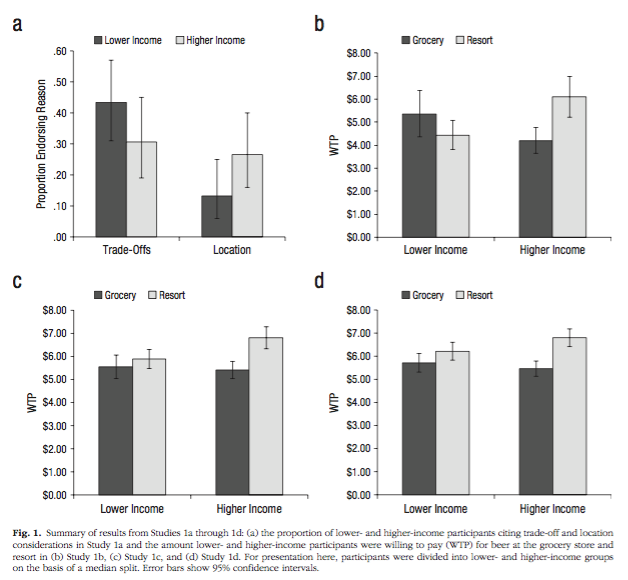
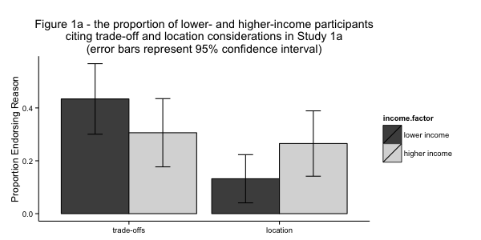
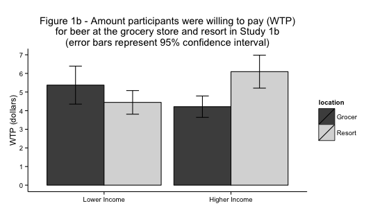
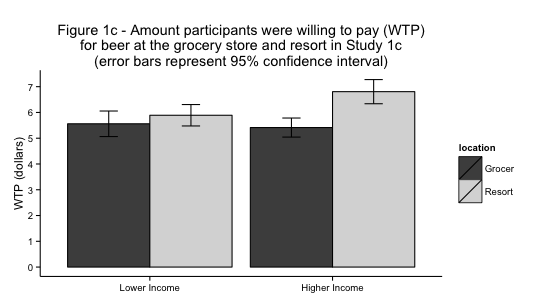
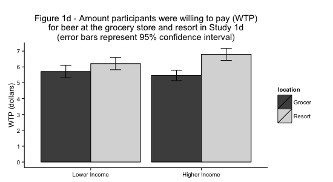
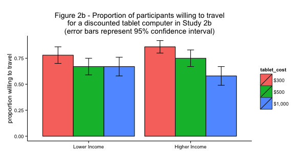
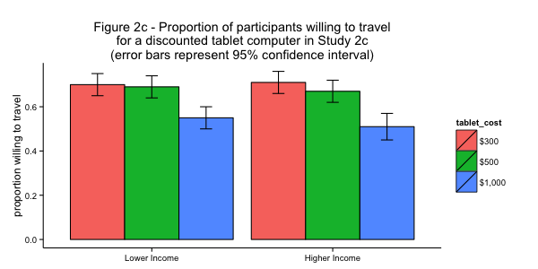
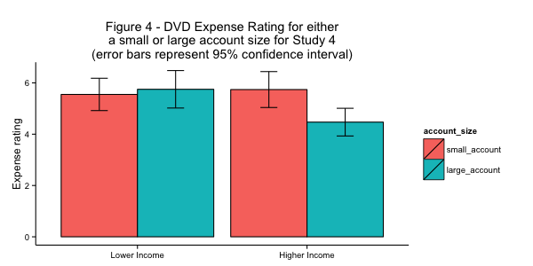
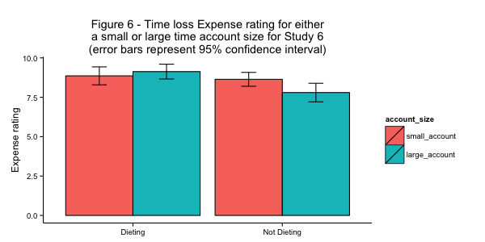

##
Shah, A. K., Mullainathan, S., & Shafir, E. (2015). Scarcity Frames Value. *Psychological Science,* 1–11. http://doi.org/10.1177/0956797614563958

**Abstract** : Economic models of decision making assume that people have a stable way of thinking about value. In contrast, psychology has shown that people’s preferences are often malleable and influenced by normatively irrelevant contextual features. Whereas economics derives its predictions from the assumption that people navigate a world of scarce resources, recent psychological work has shown that people often do not attend to scarcity. In this article, we show that when scarcity does influence cognition, it renders people less susceptible to classic context effects. Under conditions of scarcity, people focus on pressing needs and recognize the trade-offs that must be made against those needs. Those trade-offs frame perception more consistently than irrelevant contextual cues, which exert less influence. The results suggest that scarcity can align certain behaviors more closely with traditional economic predictions.

## Summary
In psychological research, the perceived value of something is subject to irrelevant contextual information. However, many economic models assume that this doesn't happen. Instead, they assume that value is derived from scarcity of resources.

This study is a series of experiments where both irrelevant contextual information, and scarcity-related information are manipulated. 

The hypothesis is: using information which invokes a scarcity mind-set will reduce or eliminate the effects of irrelevant contextual information on perceived value.  


## Replication Description & Problems

At first the beta coefficients didn't replicate, but that was because the publication reported standardized coefficients and the replication project was utilizing unstandardized coefficients. 

We found one error in reporting the number of participants in 1d and the median household size in study 2d. The errors don't adversely affect the results of the study.

## Replicating original figures

The publication originally published graphs for 1a, 1b, 1c, 1d. 
image: 

```{r, eval=FALSE, echo=FALSE,warning=FALSE, message=FALSE}
require(dplyr)
require(ggplot2)
require(foreign) # doesn't work in new R

# detect the user's directory:
directory  <- "C:/Users/Nick/Documents/Github/scarcityvalueRep"
if (Sys.getenv('USER')=="air") directory <- "~/Dropbox/SOC504/replicate"
setwd(directory)

# Function : calculates standard error of the mean
Sem <- function(x) {
  sqrt(var(x)/length(x))
  }

### Study 1a
# read in the data for 1a using the spss file
raw_1a_spss <- read.spss("framing/study_1a.sav", to.data.frame = TRUE)
clean_1a <- raw_1a_spss %>% filter(filter_. != "Not Selected")
# Plot 1a:
#computes new variables for proportion of answers, standard errors, and 95% confidence intervals for lower income group :
figure1alow <- clean_1a %>%
  filter(income2 <= 35000) %>%
  mutate(total.n = n(), 
         total.tradeoff = sum(tradeoff), 
         prop.tradeoff = sum(tradeoff)/n(), 
         total.location = sum(location), 
         prop.location = sum(location)/n(), 
         SE.tradeoff = sqrt(prop.tradeoff * (1 - prop.tradeoff)/total.n), 
         CI.tradeoff = qnorm(.975) * SE.tradeoff, SE.location = sqrt(prop.location * (1 - prop.location)/total.n), 
         CI.location = qnorm(.975) * SE.location) %>%
  distinct(prop.tradeoff, prop.location, CI.tradeoff, CI.location)
# computes new variables for proportion of answers, standard errors, and 95% confidence intervals for higher income group :
figure1ahigh <- clean_1a %>%
  filter(income2 > 35000) %>%
  mutate(total.n = n(), 
         total.tradeoff = sum(tradeoff), 
         prop.tradeoff = sum(tradeoff)/n(), 
         total.location = sum(location), 
         prop.location = sum(location)/n(), 
         SE.tradeoff = sqrt(prop.tradeoff * (1 - prop.tradeoff)/total.n), 
         CI.tradeoff = qnorm(.975) * SE.tradeoff,  
         SE.location = sqrt(prop.location * (1 - prop.location)/total.n), 
         CI.location = qnorm(.975) * SE.location) %>%
  distinct(prop.tradeoff, prop.location, CI.tradeoff, CI.location)
# Generates figure 1a :
title <- factor(c("trade-offs", "location"), 
               levels = c("trade-offs", "location"))
values <- c(figure1alow$prop.tradeoff, figure1alow$prop.location,
           figure1ahigh$prop.tradeoff, figure1ahigh$prop.location)
income <- c("lower income", "lower income", 
           "higher income", "higher income")
CIs <- c(figure1alow$CI.tradeoff, figure1alow$CI.location, 
        figure1ahigh$CI.tradeoff, figure1ahigh$CI.location)
fig1a.table <- data.frame(title, values, income, CIs)
income.factor <- factor(fig1a.table$income, 
                        levels = c("lower income", "higher income"))
figure1a <- fig1a.table %>%
  ggplot(aes(x = title, y = values, fill = income.factor)) + 
  geom_bar(stat = "identity", 
           position = position_dodge(), 
           colour = "black") + 
  ylab("Proportion Endorsing Reason") + 
  xlab(NULL) + 
  geom_errorbar(aes(ymin = values - CIs, 
                    ymax = values + CIs), 
                width = 0.2, position = position_dodge(0.9)) + 
  theme_bw() + scale_fill_grey(start = .3, end = .85) + 
  ggtitle("Figure 1a - the proportion of lower- and higher-income participants\nciting trade-off and location considerations in Study 1a\n(error bars represent 95% confidence interval)") + 
  theme(panel.border = element_blank(), 
        panel.grid.major = element_blank(), 
        panel.grid.minor = element_blank(), 
        axis.line = element_line(colour = "black"))

### Study 1b
# read in the data for 1b using the spss file:
raw_1b_spss <- read.spss("framing/study_1b.sav", to.data.frame = TRUE)
clean_1b <- raw_1b_spss %>% filter(filter_. != "Not Selected")
# for figure 1b:
clean_1b_high_resort <- clean_1b %>%
  filter(split == 1, resort == 1) %>%
  mutate(mean.beer = mean(beer), CI = (1.96 * Sem(beer))) %>%
  distinct(mean.beer, CI)
clean_1b_high_grocer <- clean_1b %>%
  filter(split == 1, resort == 0) %>%
  mutate(mean.beer = mean(beer), CI = (1.96 * Sem(beer))) %>%
  distinct(mean.beer, CI)
clean_1b_low_resort <- clean_1b %>%
  filter(split == 0, resort == 1) %>%
  mutate(mean.beer = mean(beer), CI = (1.96 * Sem(beer))) %>%
  distinct(mean.beer, CI)
clean_1b_low_grocer <- clean_1b %>%
  filter(split == 0, resort == 0) %>%
  mutate(mean.beer = mean(beer), CI = (1.96 * Sem(beer))) %>%
  distinct(mean.beer, CI)
# Figure 1b plot:
title <-  factor(c("Lower Income", "Higher Income"), 
                  levels = c("Lower Income", "Higher Income"))
values <- c(clean_1b_low_grocer$mean.beer, 
            clean_1b_high_grocer$mean.beer, 
            clean_1b_low_resort$mean.beer, 
            clean_1b_high_resort$mean.beer)
location <- c("Grocer", "Grocer", "Resort", "Resort")
CIs <- c(clean_1b_low_grocer$CI, 
         clean_1b_high_grocer$CI, 
         clean_1b_low_resort$CI, 
         clean_1b_high_resort$CI)
fig1b.table <- data.frame(title, values, location, CIs)
figure1b <- fig1b.table %>%
  ggplot(aes(x = title, y = values, fill = location)) + 
  geom_bar(stat = "identity", 
           position = position_dodge(), 
           colour = "black") + 
  ylab("WTP (dollars)") + 
  xlab(NULL) + 
  geom_errorbar(aes(ymin = values - CIs, ymax = values + CIs), 
                width = 0.2, position = position_dodge(0.9)) + 
  theme_bw() + 
  scale_fill_grey(start = .3, end = .85) + 
  ggtitle("Figure 1b - Amount participants were willing to pay (WTP)\nfor beer at the grocery store and resort in Study 1b\n(error bars represent 95% confidence interval)") + 
  scale_y_continuous(breaks = seq(0, 8, 1)) + 
  theme(panel.border = element_blank(), 
        panel.grid.major = element_blank(),
        panel.grid.minor = element_blank(), 
        axis.line = element_line(colour = "black"))

### Study 1c
#read in the data for 1c using the spss file:
raw_1c_spss <- read.spss("framing/study_1c.sav", to.data.frame = TRUE)
clean_1c <- raw_1c_spss %>% filter(filter_. != "Not Selected")
# for figure 1c
clean_1c_high_resort <- clean_1c %>%
  filter(split == 1, resort == 1) %>%
  mutate(mean.pay = mean(pay), CI = (1.96 * Sem(pay))) %>%
  distinct(mean.pay, CI)
clean_1c_high_grocer <- clean_1c %>%
  filter(split == 1, resort == 0) %>%
  mutate(mean.pay = mean(pay), CI = (1.96 * Sem(pay))) %>%
  distinct(mean.pay, CI)
clean_1c_low_resort <- clean_1c %>%
  filter(split == 0, resort == 1) %>%
  mutate(mean.pay = mean(pay), CI = (1.96 * Sem(pay))) %>%
  distinct(mean.pay, CI)
clean_1c_low_grocer <- clean_1c %>%
  filter(split == 0, resort == 0) %>%
  mutate(mean.pay = mean(pay), CI = (1.96 * Sem(pay))) %>%
  distinct(mean.pay, CI)
# Generates figure 1c
title <- factor(c("Lower Income", "Higher Income"), 
                levels = c("Lower Income", "Higher Income"))
values <- c(clean_1c_low_grocer$mean.pay, 
            clean_1c_high_grocer$mean.pay, 
            clean_1c_low_resort$mean.pay, 
            clean_1c_high_resort$mean.pay)
location <- c("Grocer", "Grocer", "Resort", "Resort")
CIs = c(clean_1c_low_grocer$CI, 
        clean_1c_high_grocer$CI, 
        clean_1c_low_resort$CI, 
        clean_1c_high_resort$CI)
fig1c.table <- data.frame(title, values, location, CIs)
figure1c <- fig1c.table %>%
  ggplot(aes(x = title, y = values, fill = location)) + 
  geom_bar(stat = "identity", 
           position = position_dodge(), 
           colour = "black") + 
  ylab("WTP (dollars)") + xlab(NULL) + 
  geom_errorbar(aes(ymin = values - CIs, ymax = values + CIs), 
                width = 0.2, position = position_dodge(0.9)) + 
  theme_bw() + 
  scale_fill_grey(start = .3, end = .85) + 
  ggtitle("Figure 1c - Amount participants were willing to pay (WTP)\nfor beer at the grocery store and resort in Study 1c\n(error bars represent 95% confidence interval)") + 
  scale_y_continuous(breaks = seq(0, 8, 1)) + 
  theme(panel.border = element_blank(), 
        panel.grid.major = element_blank(), 
        panel.grid.minor = element_blank(), 
        axis.line = element_line(colour = "black"))

### Study 1d
# read in the data for 1d using the spss file:
raw_1d_spss <- read.spss("framing/study_1d.sav", to.data.frame = TRUE)
clean_1d <- raw_1d_spss %>% filter(filter_. != "Not Selected")
# for figure 1d
clean_1d_high_resort <- clean_1d %>%
  filter(split == 1, resort == 1) %>%
  mutate(mean.wtp = mean(wtp), CI = (1.96 * Sem(wtp))) %>%
  distinct(mean.wtp, CI)
clean_1d_high_grocer <- clean_1d %>%
  filter(split == 1, resort == 0) %>%
  mutate(mean.wtp = mean(wtp), CI = (1.96 * Sem(wtp))) %>%
  distinct(mean.wtp, CI)
clean_1d_low_resort <- clean_1d %>%
  filter(split == 0, resort == 1) %>%
  mutate(mean.wtp = mean(wtp), CI = (1.96 * Sem(wtp))) %>%
  distinct(mean.wtp, CI)
clean_1d_low_grocer <- clean_1d %>%
  filter(split == 0, resort == 0) %>%
  mutate(mean.wtp = mean(wtp), CI = (1.96 * Sem(wtp))) %>%
  distinct(mean.wtp, CI)
title <- factor(c("Lower Income", "Higher Income"), 
                levels = c("Lower Income", "Higher Income"))
values <- c(clean_1d_low_grocer$mean.wtp, 
            clean_1d_high_grocer$mean.wtp, 
            clean_1d_low_resort$mean.wtp, 
            clean_1d_high_resort$mean.wtp)
location <- c("Grocer", "Grocer", "Resort", "Resort")
CIs <- c(clean_1d_low_grocer$CI, 
         clean_1d_high_grocer$CI, 
         clean_1d_low_resort$CI, 
         clean_1d_high_resort$CI)
fig1d.table <- data.frame(title, values, location, CIs)
# Generates figure 1d:
figure1d <- fig1d.table %>%
  ggplot(aes(x = title, y = values, fill = location)) + 
  geom_bar(stat = "identity", position = position_dodge(), 
           colour = "black") + 
  ylab("WTP (dollars)") + xlab(NULL) + 
  geom_errorbar(aes(ymin = values - CIs, ymax = values + CIs), 
                width = 0.2, position = position_dodge(0.9)) + 
  theme_bw() + 
  scale_fill_grey(start = .3, end = .85) + 
  ggtitle("Figure 1d - Amount participants were willing to pay (WTP)\nfor beer at the grocery store and resort in Study 1d\n(error bars represent 95% confidence interval)") + 
  scale_y_continuous(breaks = seq(0, 8, 1)) + 
  theme(panel.border = element_blank(), 
        panel.grid.major = element_blank(), 
        panel.grid.minor = element_blank(), 
        axis.line = element_line(colour = "black"))

# PLOT figures: 
print(figure1a)
print(figure1b)
print(figure1c)
print(figure1d)
```

## Replicating 1a
 

## Replicating 1b


## Replicating 1c


## Replicating 1d


## Extension : added graph


## Extension : added graph


## Extension : added graph


## Extension : added graph


## Extension : added graph


## Extension : added graph


## Three Things Learned

1. Understanding someone else's process and code takes time.
2. Git is useful for collaboration and tracking changes.
3. Errors in publications can happen & robust coding practices helps to avoid them. 

## Thank you

